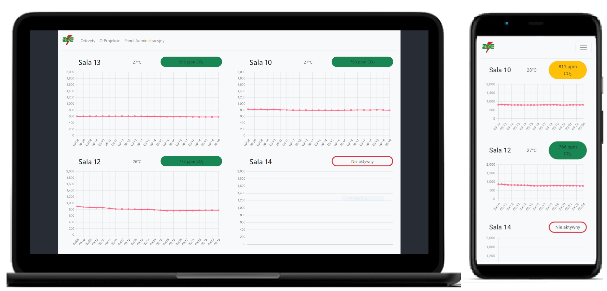

# Introduction
**Room Ventilation Monitoring System** is a network of self-made sensor-signal devices deployed in the [school](https://zsel.edu.pl/index.php). The system is designed to inform school staff of the necessity of ventilating a room, as well as collect data for research on the impact of air quality on work and learning efficiency. The project took part in the Explory 2022 science festival in Olsztyn.

# Sensor

## Used Components
- Microcontroller ESP 8266 
- Photoelectric sensor MH-Z19
- External power supply 12V 1.5A
- Step-down inverter MP1454EN
- Led diods WS2812B

# Application
## REST API

## Web Application
### Results Preview

### Admin Panel

## Used Technologies
- Java 17
- Maven
- Spring Boot
- My SQL database
- React

# Installation